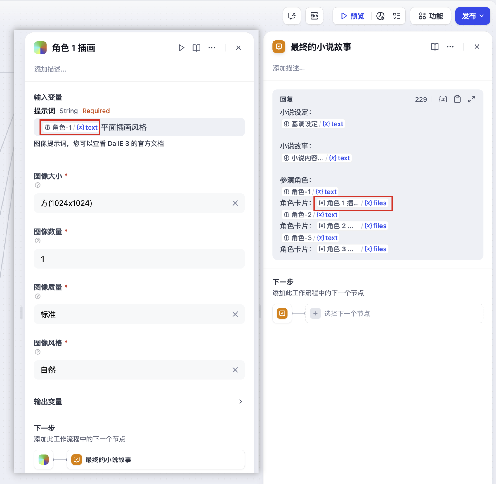

# DALL-E 绘图

> 工具作者 @TGAI。

DALL-E 是由 OpenAI 开发的一种基于文本提示生成图像的工具。TGAI 已接入 DALL-E 工具，以下是在 TGAI 中配置和使用 DALL-E 绘图工具的步骤。

## 1. 申请 OpenAI 的 API Key

请在 [OpenAI Platform](https://platform.openai.com/)申请 API Key，并确保账户内有足够的 Credits。

## 2. 在 TGAI 内填写配置

在 TGAI 导航页内轻点 `工具 > DALL-E > 去授权` 填写 API Key。

<figure><figcaption></figcaption></figure>

## 3. 使用工具

- **Chatflow / Workflow 应用**

Chatflow 和 Workflow 应用均支持添加 `DALL-E 绘图` 工具节点。添加后，需要在节点内的 “输入变量 → 提示词” 内填写[变量](https://docs.dify.ai/v/zh-hans/guides/workflow/variables)引用用户输入的提示词，或者是上一节点生成的内容。最后在 “结束” 节点内使用变量引用 `DALL-E 绘图` 输出的图像。

<figure><figcaption></figcaption></figure>

- **Agent 应用**

在 Agent 应用内添加 `DALL-E` 工具，然后在对话框内发送图片描述，调用工具生成 AI 图像。

<figure><figcaption></figcaption></figure>
